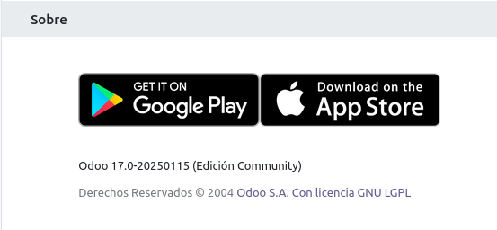
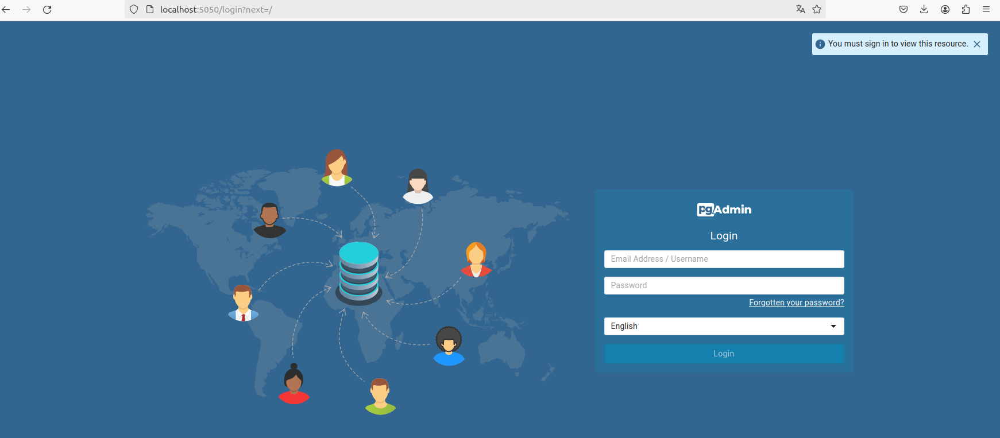
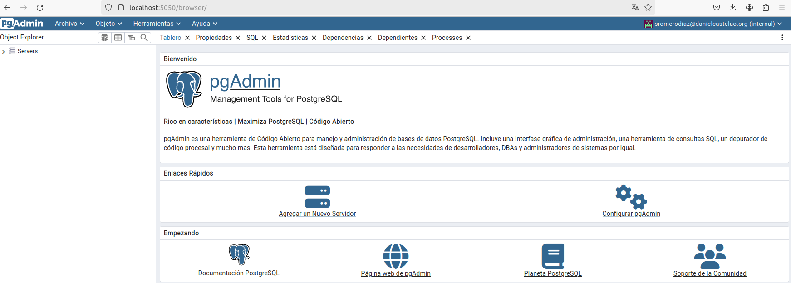
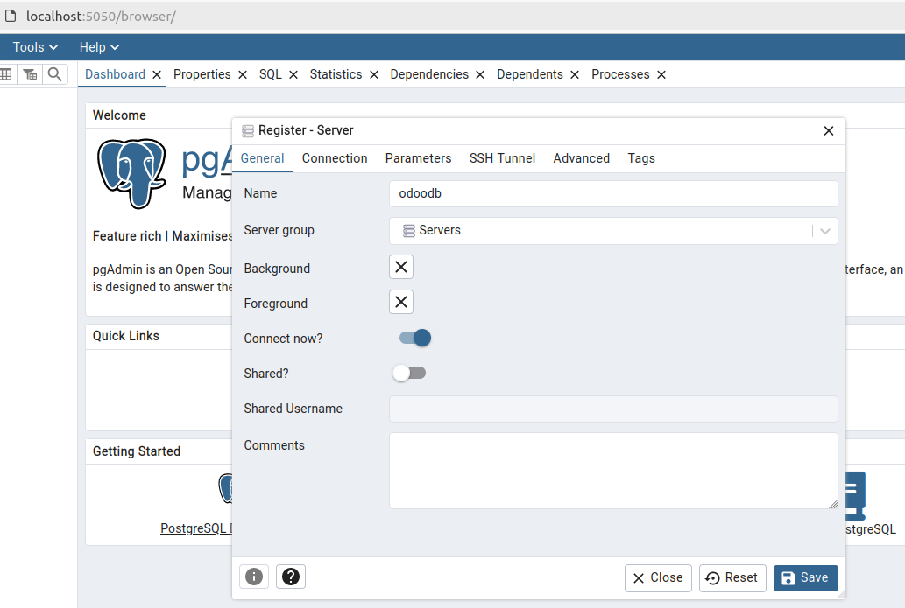
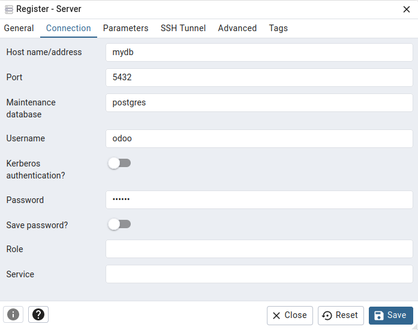
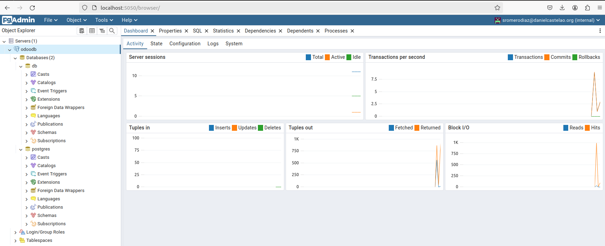

# SXE - Tarea 10 - Odoo + PgAdmin

## Instala Odoo 17 Community con docker-compose.

Los comandos empleados durante esta parte son los siguientes:

```
mkdir SXE_Tarea10
cd SXE_Tarea10
touch README.md
touch docker-compose.yml
```

Desde tu editor de texto favorito abre el archivo **docker-compose.yml** y pega el siguiente código:

```
services:
  web:
    image: odoo:17.0
    depends_on:
      - mydb
    ports:
      - "8069:8069"
    environment:
      HOST: mydb
      USER: odoo
      PASSWORD: myodoo
    volumes:
      - odoo-web-data:/var/lib/odoo

volumes:
  odoo-web-data:
```

**Cierra y guarda el archivo** para luego ejecutar el comando `sudo docker compose up -d`. Este comando levanta los contenedores en segundo plano.

Si lo que vemos es lo siguiente entonces todo ha ido correctamente:


Para confirmarlo definitavemente, si vas a la direccion `http://localhost:8069` debería cargarte la siguiente página:


Para esto es mejor marcar la casilla ***demo data*** ya que a la hora de implementar más módulos no hará falta meter datos manualmente para comenzar a trabajar con ellos.


Al haber iniciado sesión se abre el siguiente panel:


Para confirmar que se ha instalado la versión community puedes ir a **Ajustes** y scrollear hasta abajo, en el apartado **Sobre** deberías ver lo siguiente:



## Instala PgAdmin y conectala a lo BBDD

A continuación la configuración de PgAdmin en el archivo `docker-compose.yml`:

```
# resto de configuración mostrada anteriormente
pgadmin: 
    restart: unless-stopped 
    image: dpage/pgadmin4:latest 
    container_name: pgAdmin
    depends_on: 
      - mydb
    ports: 
      - "5050:80"
    environment: 
      PGADMIN_DEFAULT_EMAIL: sromerodiaz@danielcastelao.org # mi correo 
      PGADMIN_DEFAULT_PASSWORD: 123
    volumes: 
      - pgadmin-data:/var/lib/pgadmin # establece la persistencia de los datos para no perderlos

volumes: # declaracion de persistencias de todo lo declarado anteriormente
  odoo-web-data: 
  odoo-db-data: 
  pgadmin-data: 
```

### Verificación de la instalación de PgAdmin

Una vez tengas todo en regla dentro del archivo `docker-compose.yml`, levantalo y comprueba también la instalación de *pgAdmin* de la siguiente manera:

```
Accede a http://(tu IP seleccionada):5050 en tu navegador
```

De esta forma verás lo siguiente:



Introduce las credenciales, **(las del archivo docker compose)** y esto es lo que aparece:




### Solución de un "problema"

Dentro de PgAdmin no se encuentra nada en el *Dashboard* y esto es porque se tiene que **vincular** desde `Add New Service`:



- - En el apartado "Connection" introduce los siguientes datos.



- - Al guardar la configuración y volver al Inicio aparecen las BBDDs.



## ¿Que ocurre si en el ordenador local el puerto 5432 está ocupado? ¿Y si lo estuviese el 8069? ¿Como puedes solucionarlo?

