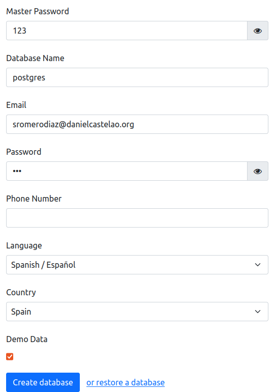
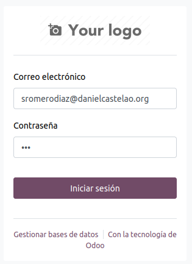
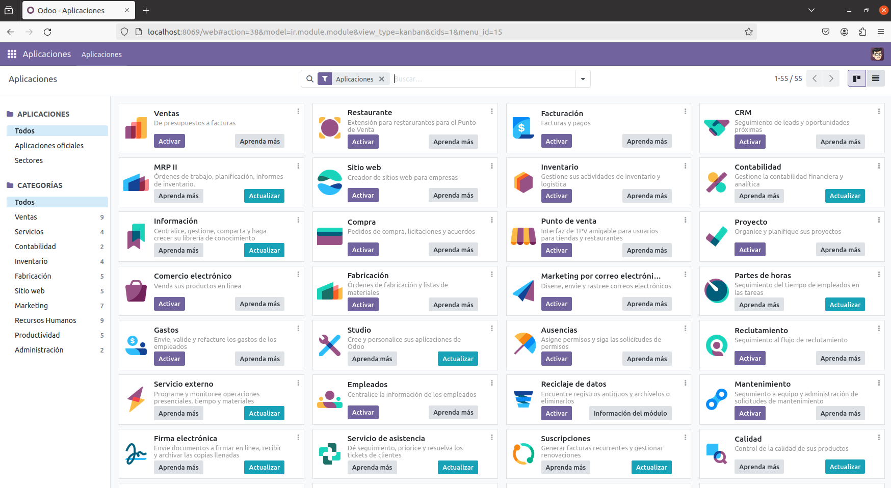

# SXE - Tarea 10 - Odoo + PgAdmin

## Instala Odoo 17 Community con docker-compose.

Los comandos empleados durante esta parte son los siguientes:

```
mkdir SXE_Tarea10
cd SXE_Tarea10
touch README.md
touch docker-compose.yml
```

Desde tu editor de texto favorito abre el archivo **docker-compose.yml** y pega el siguiente código:

```
services:
  web:
    image: odoo:17.0
    depends_on:
      - mydb
    ports:
      - "8069:8069"
    environment:
      HOST: mydb
      USER: odoo
      PASSWORD: myodoo
    volumes:
      - odoo-web-data:/var/lib/odoo

volumes:
  odoo-web-data:
```

**Cierra y guarda el archivo** para luego ejecutar el comando `sudo docker compose up -d`. Este comando levanta los contenedores en segundo plano.

Si lo que vemos es lo siguiente entonces todo ha ido correctamente:


Para confirmarlo definitavemente, si vas a la direccion `http://localhost:8069` debería cargarte la siguiente página:




Para esto es mejor marcar la casilla ***demo data*** ya que a la hora de implementar más módulos no hará falta meter datos manualmente para comenzar a trabajar con ellos.



Al haber iniciado sesión se abre el siguiente panel:



## Instala PgAdmin y conectala a lo BBDD

A continuación la configuración de PgAdmin en el archivo `docker-compose.yml`:

```
# resto de configuración mostrada anteriormente
pgadmin: 
    restart: unless-stopped 
    image: dpage/pgadmin4:latest 
    container_name: pgAdmin
    depends_on: 
      - db
    ports: 
      - "5050:80"
    environment: 
      PGADMIN_DEFAULT_EMAIL: sromerodiaz@danielcastelao.org # mi correo 
      PGADMIN_DEFAULT_PASSWORD: 123
    volumes: 
      - pgadmin-data:/var/lib/pgadmin # establece la persistencia de los datos para no perderlos

volumes: # declaracion de persistencias de todo lo declarado anteriormente
  odoo-web-data: 
  odoo-db-data: 
  pgadmin-data: 
```

En el readme tiene que estar explicado las diferentes partes del docker-composer, así como los comandos para lanzar los contenedores y capturas de pantalla que demuestren la instalación de Odoo, configuración y acceso al mismo así como de PgAdmin. Es necesario incluir una captura DENTRO de Odoo para demostrar que se ha instalado y configurado correctamente y también dentro de PgAdmin (instalad primero odoo y cread una base de datos).

## ¿Que ocurre si en el ordenador local el puerto 5432 está ocupado? ¿Y si lo estuviese el 8069? ¿Como puedes solucionarlo?

